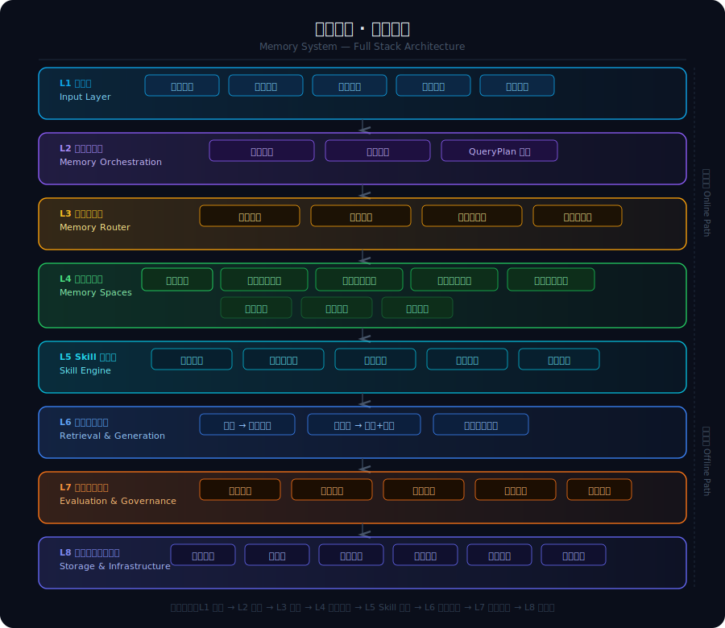
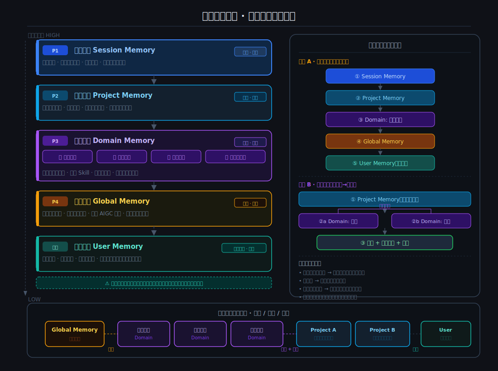
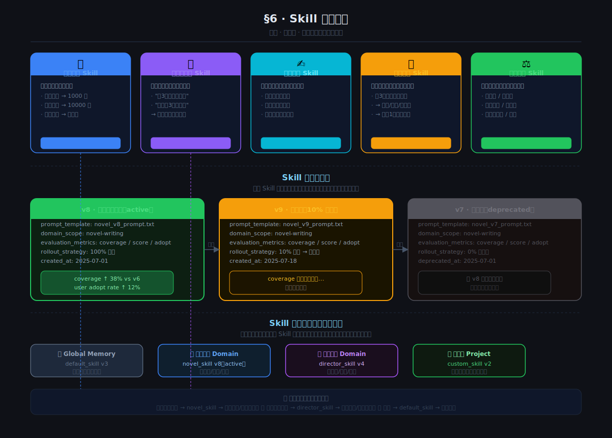
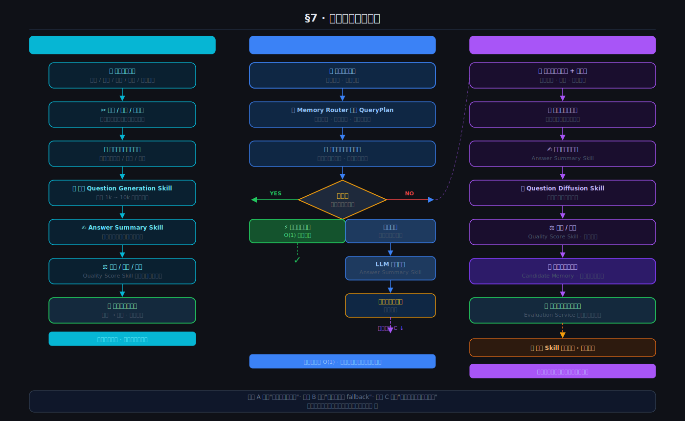
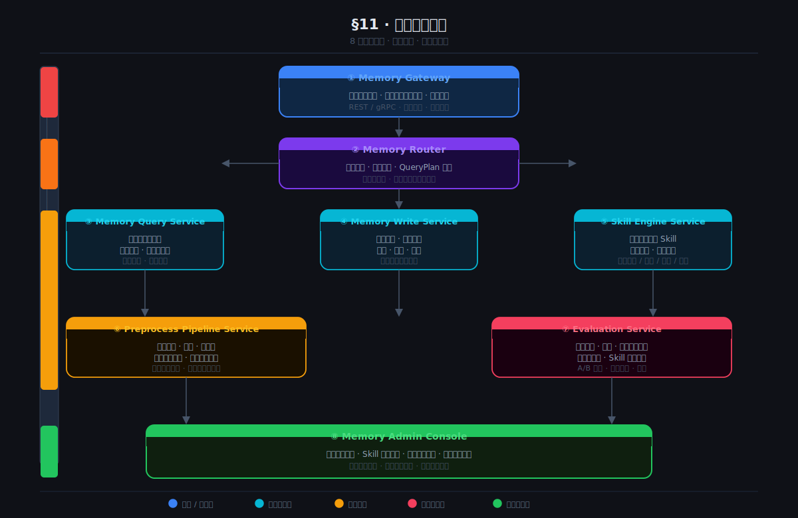
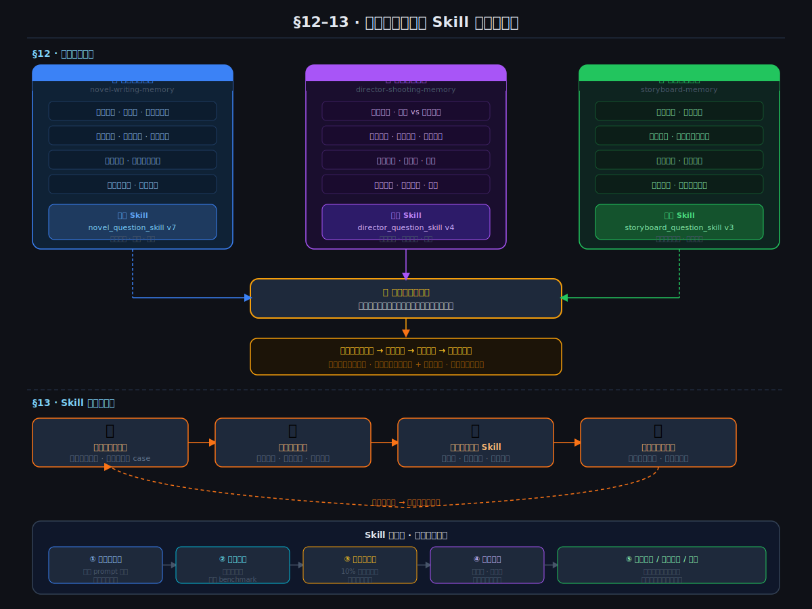

# 记忆系统工程架构设计

> 基于《记忆系统架构思考》的工程化延展版本  
> 目标：将“记忆 = 问题 → 直接答案”的方法论，落成一个可扩展、可隔离、可迭代、可运营的工程系统  
> 状态：架构设计稿

---

# 一、设计目标

这份设计文档的核心目标，不再只是解释“记忆是什么”，而是回答一个更工程化的问题：

> **如果要真正做一个可运行的记忆系统平台，应该如何设计它的系统架构、模块边界、数据隔离、运行机制与演进路径？**

在原有方法论基础上，这一版架构重点补充以下工程诉求：

1. **多记忆空间隔离**
   - 小说创作类记忆
   - 导演拍摄类记忆
   - 分镜类记忆
   - 角色设定类记忆
   - 世界观设定类记忆
   - 全局通识记忆
   - 用户个人记忆
   - 项目级专属记忆

2. **多层级记忆协同**
   - 全局记忆负责通用知识
   - 领域记忆负责专业知识
   - 项目记忆负责当前任务上下文
   - 会话记忆负责短期交互
   - 用户记忆负责长期偏好

3. **Skill 独立迭代**
   - 每个记忆空间都可以拥有自己的提问生成 Skill
   - 每个 Skill 可以独立升级
   - 不同方向的数据处理策略不同
   - Skill 本身也成为可训练、可评估、可版本化的系统资产

4. **工程上可运营**
   - 支持增量写入
   - 支持回溯
   - 支持评分
   - 支持淘汰
   - 支持灰度升级
   - 支持不同租户/不同业务线独立运行

---

# 二、核心设计原则

## 2.1 第一原则：记忆不是资料库，而是答案系统

传统知识库的核心是“存资料”。

而这里的记忆系统，其核心是：

> **存储能够被直接命中的问题 → 答案映射。**

所以系统中最重要的不是原始文档本身，而是：
- 问题
- 答案
- 问题的变体
- 命中规则
- 置信度
- 来源链路
- 适用范围

原始资料只是记忆生成的燃料，不是终态。

---

## 2.2 第二原则：记忆必须分层，而不能只有一个大池子

如果所有问答都塞进一个统一大库，会很快出现问题：

- 小说创作记忆和导演拍摄记忆互相污染
- 通用知识与项目私有知识混淆
- 用户个人偏好和平台共性知识冲突
- 不同场景下答案风格不一致
- 技能升级无法独立评估

因此必须采用：

> **全局层 + 领域层 + 项目层 + 用户层 + 会话层**

的分层记忆结构。

---

## 2.3 第三原则：记忆空间必须可隔离、可组合、可继承

举例：

- 小说创作方向，需要角色、剧情、伏笔、冲突、成长线记忆
- 导演拍摄方向，需要镜头语言、调度、表演、场面设计、情绪节奏记忆

这两个方向有交集，但不能强耦合。

所以工程上要支持：

- **隔离**：各自独立存储、独立提取、独立召回
- **组合**：在需要时联合查询多个记忆空间
- **继承**：领域记忆可继承全局记忆的能力
- **覆盖**：项目记忆可以覆盖全局记忆中的通用答案
- **优先级**：更贴近当前任务的记忆优先命中

---

## 2.4 第四原则：Skill 不是硬编码逻辑，而是可迭代资产

如果用传统代码写“怎么提问题”，会陷入无穷维护。

所以这里要把 Skill 抽象为：

- 可配置
- 可版本化
- 可评估
- 可替换
- 可回滚
- 可按记忆空间绑定

也就是说：

> **问题生成 Skill、答案总结 Skill、质量评分 Skill、问题扩散 Skill，都是独立资产。**

---

## 2.5 第五原则：所有未命中，都是未来记忆的入口

未命中不是失败，而是学习入口。

每次未命中，都应该触发：

1. 搜索和总结生成答案
2. 把本次问答写入候选记忆
3. 发散生成相关问题
4. 更新该记忆空间的 Skill 训练样本
5. 进入后续评估和筛选流程

所以系统不是静态库，而是：

> **一个持续把“未知问题”转化为“未来直接答案”的增量记忆工厂。**

---

# 三、系统总览

## 3.1 总体目标架构

从工程角度，整个系统可以拆为 8 个核心层：

1. **输入层**
2. **记忆编排层**
3. **记忆路由层**
4. **记忆空间层**
5. **Skill 引擎层**
6. **检索与生成层**
7. **评估与治理层**
8. **存储与基础设施层**

它们的关系如下：

```/dev/null/architecture.txt#L1-26
用户/系统输入
    ↓
输入层（文档、会话、任务、行为日志）
    ↓
记忆编排层（识别场景、选择策略、组装查询计划）
    ↓
记忆路由层（决定查哪些记忆空间、按什么优先级查）
    ↓
记忆空间层
    ├── 全局记忆
    ├── 领域记忆：小说创作
    ├── 领域记忆：导演拍摄
    ├── 领域记忆：分镜设计
    ├── 项目记忆
    ├── 用户记忆
    └── 会话记忆
    ↓
Skill 引擎层
    ├── 问题生成 Skill
    ├── 问题改写 Skill
    ├── 答案总结 Skill
    ├── 问题扩散 Skill
    └── 质量评分 Skill
    ↓
检索与生成层（命中直返 / 未命中搜索+总结 / 增量回写）
    ↓
评估与治理层（评分、去重、淘汰、版本管理、灰度）
    ↓
存储与基础设施层（库、索引、队列、日志、监控）
```



---

# 四、记忆分层架构设计

## 4.1 全局记忆 Global Memory

### 定义
平台范围共享的通用记忆。

### 内容示例
- 通用叙事结构知识
- 通用导演术语知识
- 通用影视语言知识
- 通用 AIGC 工作流知识
- 通用人物塑造知识

### 特点
- 跨用户共享
- 更新较审慎
- 质量要求最高
- 更偏“平台级基础能力”

### 作用
- 为所有领域记忆提供底座
- 提供默认答案基准
- 提供通用问题生成模板参考

---

## 4.2 领域记忆 Domain Memory

这是本系统工程隔离的核心。

### 领域记忆示例
- `novel-writing-memory`：小说创作记忆
- `director-shooting-memory`：导演拍摄记忆
- `screenplay-memory`：剧本创作记忆
- `storyboard-memory`：分镜设计记忆
- `character-design-memory`：角色设计记忆
- `worldbuilding-memory`：世界观设定记忆

### 为什么要拆开
因为不同领域的“好问题”完全不同。

例如：

#### 小说创作类常见问题
- 主角成长弧是否完整？
- 第三幕冲突是否足够强？
- 这个角色的动机有没有前后矛盾？
- 这章结尾是否形成追读钩子？
- 伏笔回收是否自然？

#### 导演拍摄类常见问题
- 这一场戏适合固定镜头还是运动镜头？
- 情绪高潮段落如何调度演员走位？
- 这里用长镜头还是切镜更合适？
- 光线如何帮助强化压迫感？
- 这场戏该如何设计主观镜头？

这两类问题的抽象方式、提问方式、答案结构、评价标准都不同。

### 结论
> **每个领域必须拥有自己的独立记忆空间和独立 Skill。**

---

## 4.3 项目记忆 Project Memory

### 定义
围绕某个具体项目形成的专属记忆。

例如：
- 某部小说项目
- 某个影视项目
- 某个剧本开发项目
- 某个 IP 世界观项目

### 内容
- 项目角色设定
- 项目剧情脉络
- 项目术语表
- 项目风格约束
- 项目问答积累
- 项目内部偏好与约定

### 特点
- 私有性强
- 生命周期跟随项目
- 对当前任务命中优先级高于全局记忆
- 是最强的“上下文长期化”载体

### 典型例子
全局记忆知道“反英雄角色通常具备复杂动机”。

但项目记忆知道：
- 这个具体角色叫什么
- 其第三章说过什么
- 第七章埋了什么伏笔
- 当前禁止改写哪些设定

---

## 4.4 用户记忆 User Memory

### 定义
围绕单个用户长期沉淀的偏好与习惯。

### 内容
- 偏好的写作风格
- 偏好的镜头语言
- 常用提示方式
- 常见修改倾向
- 常见否决点
- 表达风格和工作习惯

### 作用
让系统不仅“知道问题答案”，还“知道该怎么对你回答”。

### 示例
用户 A 偏好：
- 更理性结构化表达
- 少修辞
- 偏长篇布局
- 偏现实主义风格

用户 B 偏好：
- 更诗性表达
- 强情绪张力
- 偏短视频节奏
- 喜欢夸张镜头感

同一个问题，在用户记忆不同的情况下，答案的组织方式应不同。

---

## 4.5 会话记忆 Session Memory

### 定义
当前一次对话或短任务内的临时记忆。

### 内容
- 当前问题链路
- 当前推理中间状态
- 当前文档片段
- 当前用户指令目标
- 临时约束

### 作用
- 保证多轮交互连贯
- 避免每轮都重新理解当前局部状态
- 生命周期短，但实时性强

---

# 五、记忆空间模型设计

## 5.1 记忆空间的标准抽象

每个记忆空间都应有统一的工程定义：

```/dev/null/memory-space-schema.txt#L1-16
MemorySpace
- id
- name
- type              # global / domain / project / user / session
- parent_ids        # 支持继承与组合
- status            # active / readonly / archived
- owner_scope       # 平台 / 团队 / 项目 / 用户
- bound_skills      # 绑定的 skill 版本集合
- retrieval_policy  # 检索策略
- write_policy      # 写入策略
- score_policy      # 评分策略
- ttl_policy        # 生命周期策略
- quality_threshold # 质量阈值
- metadata          # 自定义元信息
```

---

## 5.2 记忆空间的继承与覆盖关系

建议使用“链式优先级查询”。

例如一个用户在某个小说项目中提问时，查询链可为：

```/dev/null/query-chain.txt#L1-7
Session Memory
    > Project Memory
        > Domain Memory: Novel Writing
            > Global Memory
                > User Memory（风格修正层）
```

更准确地说，不同层不是简单串行，而是：

- 先按优先级召回
- 再进行融合
- 再根据答案冲突做覆盖决策

### 推荐优先级
1. 会话记忆
2. 项目记忆
3. 领域记忆
4. 全局记忆
5. 用户记忆用于答案风格调制，而不是事实覆盖

---

## 5.3 多领域联合查询

某些复杂任务会同时涉及多个领域。

例如：
> “请把这一段小说高潮改成适合导演拍摄的分镜方案。”

此时需要联合：
- 小说创作记忆
- 导演拍摄记忆
- 分镜设计记忆
- 项目记忆

因此系统必须支持：

- 多记忆空间并行召回
- 结果聚合
- 冲突消解
- 主领域优先
- 辅领域增强

建议引入：

```/dev/null/query-plan.txt#L1-9
QueryPlan
- primary_memory_space
- secondary_memory_spaces[]
- recall_top_k_per_space
- merge_strategy
- conflict_resolution_strategy
- answer_style_policy
```



---

# 六、Skill 系统设计

## 6.1 Skill 的定位

Skill 不是普通 prompt，也不是死逻辑。

Skill 是一组可复用、可升级、可评估的能力模块，用于：

- 从原始资料生成问题
- 从问题生成答案
- 对问题做改写和归并
- 对答案做评分和筛选
- 对未命中问题做发散扩展

---

## 6.2 Skill 的分类

建议拆成以下五大类：

### 1）问题生成 Skill
从原始资料中发散出大量潜在问题。

例如：
- 基于角色设定生成 1000 个相关问题
- 基于章节内容生成 10000 个剧情问题
- 基于导演脚本生成镜头与调度问题

### 2）问题归一化 Skill
将不同说法的问题归一为标准问题。

例如：
- “主角第三次遇险发生了什么？”
- “男主第 3 回陷入危机是哪一段？”
- “这本小说里主角第三次陷入险境的情节是什么？”

应归并到同一标准问题簇。

### 3）答案总结 Skill
把检索到的材料压缩成可直接返回的高质量答案。

### 4）问题扩散 Skill
围绕已知问题生成相邻问题。

例如：
- 从“第三次遇险是什么”扩散出：
  - 第一次遇险是什么？
  - 第三次遇险的诱因是什么？
  - 第三次遇险如何推动角色成长？
  - 第三次遇险的伏笔在哪一章？

### 5）质量评分 Skill
评估问答对是否应进入正式记忆。

评分维度包括：
- 准确性
- 完整性
- 可复用性
- 去重度
- 覆盖价值
- 领域相关性

---

## 6.3 Skill 的版本化设计

每个 Skill 都必须支持版本管理。

```/dev/null/skill-schema.txt#L1-14
Skill
- id
- name
- type
- domain_scope
- version
- prompt_template
- config
- evaluation_metrics
- rollout_strategy
- status
- created_at
- updated_at
```

### 为什么必须版本化
因为：
- 不同版本生成的问题质量不同
- 升级后可能覆盖率更高，也可能更差
- 必须支持灰度和回滚
- 必须知道某条记忆是由哪个 Skill 版本生成的

---

## 6.4 Skill 与记忆空间的绑定关系

建议允许：

- 全局默认 Skill
- 领域定制 Skill
- 项目覆盖 Skill

例如：

```/dev/null/skill-binding.txt#L1-10
Global Memory
  -> default_question_generation_skill v3

Domain: Novel Writing
  -> novel_question_generation_skill v7

Domain: Director Shooting
  -> director_question_generation_skill v4

Project: 某小说项目
  -> custom_project_question_generation_skill v2
```

这意味着：
> 同样一段输入数据，不同记忆空间会生成不同风格、不同粒度的问题集合。



---

# 七、核心处理链路设计

## 7.1 预处理链路

用于“数据先入库”。

### 输入
- 小说章节
- 角色设定
- 世界观设定
- 剧本
- 分镜稿
- 导演阐述
- 用户上传资料

### 处理流程

```/dev/null/preprocess-flow.txt#L1-12
原始资料
  ↓
资料切分 / 清洗 / 结构化
  ↓
选择所属记忆空间
  ↓
调用该空间绑定的 Question Generation Skill
  ↓
生成大规模问题集合
  ↓
生成对应答案
  ↓
评分 / 去重 / 筛选
  ↓
写入正式记忆库
```

### 关键点
预处理不是一次性导入文档，而是：
> 把文档转化为“未来可能被问到的问题集合”。

---

## 7.2 在线问答链路

用于“用户实时提问”。

### 标准流程

```/dev/null/online-qa-flow.txt#L1-16
用户提问
  ↓
问题分类（是什么领域？）
  ↓
构建 QueryPlan
  ↓
优先查询相关记忆空间
  ↓
如果高置信命中
    → 直接返回答案
否则
    → 进入搜索 + 总结流程
        ↓
      返回答案
        ↓
      将本次问答写入候选记忆
        ↓
      触发问题扩散
        ↓
      进入后续增量处理流水线
```

---

## 7.3 未命中增量学习链路

这是系统成长的核心。

### 流程
1. 记录未命中问题
2. 记录上下文和所属记忆空间
3. 检索原始资料
4. 生成答案
5. 生成相关问题簇
6. 评分与筛选
7. 写入候选记忆
8. 异步晋升为正式记忆

### 注意
未命中的内容不一定直接入正式库。

建议设计两层：

- **候选记忆层 Candidate Memory**
- **正式记忆层 Official Memory**

这样可以避免低质量内容污染主库。



---

# 八、存储模型设计

## 8.1 建议的存储分层

系统不应只有一种库，而应多种存储配合：

### 1）原始资料库
存文档、章节、设定、脚本等原始内容。

### 2）问题答案库
存正式问答对，是记忆主库。

### 3）候选记忆库
存未完全验证的新生成问答对。

### 4）向量索引库
支持语义召回、相似问题归并。

### 5）关系索引库
记录问题之间、答案之间、来源之间的关系图谱。

### 6）日志与事件库
记录命中率、未命中率、写入行为、Skill 效果。

---

## 8.2 核心问答记录结构

```/dev/null/qa-record.txt#L1-24
MemoryQARecord
- id
- memory_space_id
- canonical_question
- question_variants[]
- answer
- answer_summary
- source_refs[]
- source_type
- quality_score
- confidence_score
- usage_score
- freshness_score
- generated_by_skill_version
- answer_by_skill_version
- score_by_skill_version
- status                 # candidate / active / deprecated / archived
- tags[]
- related_question_ids[]
- created_at
- updated_at
- last_hit_at
- hit_count
```

---

## 8.3 为什么需要候选层和正式层

因为系统会自动生成大量问答对，而这些内容质量不稳定。

如果全部直接入正式库，会很快出现：
- 重复问题泛滥
- 低质量答案污染
- 偏领域问题进入错误空间
- 一时总结错误被长期记忆化

所以建议：

### 候选层
- 快速接收增量结果
- 允许低门槛写入
- 后续评估后决定是否晋升

### 正式层
- 高质量、高稳定性
- 用于线上高优先级命中

---

# 九、检索与路由架构

## 9.1 路由器的职责

记忆路由器是整个系统的“大脑之一”。

它的职责不是直接回答问题，而是判断：

- 当前问题属于哪个领域
- 应优先查哪些记忆空间
- 是否需要多空间联合召回
- 命中阈值是多少
- 低置信命中后是否要回退搜索
- 最终答案应采用什么风格

---

## 9.2 路由判断维度

建议至少考虑：

- 任务类型
- 问题主题
- 用户身份
- 当前项目
- 当前会话上下文
- 历史命中表现
- 领域置信度
- 记忆空间热度

---

## 9.3 路由策略示例

### 场景 A：小说项目中的剧情问题
优先链路：
- 会话记忆
- 当前小说项目记忆
- 小说创作领域记忆
- 全局记忆

### 场景 B：导演工作台中的拍摄问题
优先链路：
- 会话记忆
- 当前项目记忆
- 导演拍摄领域记忆
- 分镜设计领域记忆
- 全局记忆

### 场景 C：跨领域任务
例如：
> “把这个剧情高潮设计成适合拍摄的导演方案。”

优先链路：
- 当前项目记忆
- 小说创作领域记忆
- 导演拍摄领域记忆
- 分镜设计领域记忆
- 全局记忆

---

# 十、评估与治理系统

## 10.1 质量治理为什么重要

记忆系统最大的风险不是“没有答案”，而是“记住了错误答案”。

所以一定要把治理系统放到核心位置。

---

## 10.2 质量评估维度

### 对问题的评估
- 是否高频
- 是否有价值
- 是否可复用
- 是否过于细碎
- 是否和已有问题重复

### 对答案的评估
- 是否准确
- 是否完整
- 是否直接
- 是否表达稳定
- 是否适合当前领域风格

### 对记忆表现的评估
- 命中率
- 首答正确率
- 用户采纳率
- 二次追问率
- 编辑修改率

---

## 10.3 生命周期治理

每条记忆都应有生命周期：

```/dev/null/lifecycle.txt#L1-8
candidate   -> 候选
active      -> 生效
deprecated  -> 弱化
archived    -> 归档
deleted     -> 删除
```

### 典型触发
- 长期无命中 → 降级
- 命中高但评分低 → 重写
- 来源失效 → 归档
- 被更高质量答案覆盖 → 弃用

---

## 10.4 A/B 测试与灰度升级

Skill 升级不能全量直接替换。

必须支持：
- 部分空间灰度
- 部分项目灰度
- 新旧版本对比
- 回滚机制

例如：
- 小说创作 Skill v7 在 10% 项目中试运行
- 比较问题覆盖率、用户采纳率、二次追问率
- 如果更优，再扩大流量

---

# 十一、工程模块划分建议

## 11.1 推荐服务拆分

建议拆为以下服务：

### 1）Memory Gateway
统一对外入口，接收所有记忆请求。

### 2）Memory Router
负责领域识别、空间选择、优先级组装。

### 3）Memory Query Service
负责从多个记忆空间召回候选答案。

### 4）Memory Write Service
负责候选记忆写入、正式记忆晋升、更新与淘汰。

### 5）Skill Engine Service
统一执行各类 Skill。

### 6）Preprocess Pipeline Service
处理文档预处理、批量问答生成。

### 7）Evaluation Service
负责质量评分、去重、监控、治理。

### 8）Memory Admin Console
运营后台，管理空间、Skill、版本、命中数据。

---

## 11.2 为什么建议服务拆分

因为这些模块变化频率不同：

- 路由策略变化很快
- Skill 变化更快
- 存储模型相对稳定
- 评估规则持续迭代
- 后台运营和线上回答职责不同

拆开后更容易：
- 独立迭代
- 独立扩缩容
- 独立观测
- 独立灰度



---

# 十二、小说创作与导演拍摄的独立记忆设计

## 12.1 小说创作类独立记忆

### 推荐子空间
- 角色塑造记忆
- 剧情推进记忆
- 冲突设计记忆
- 伏笔回收记忆
- 世界观设定记忆
- 文风偏好记忆

### 问题生成 Skill 方向
- 角色成长线问题
- 情节闭环问题
- 伏笔一致性问题
- 章节节奏问题
- 读者追读钩子问题

### 典型问题例子
- 主角这一章是否完成阶段性成长？
- 反派动机是否成立？
- 这个转折是不是过于突兀？
- 前面埋的伏笔在这里是否回收？
- 这一章结尾是否足够吊人胃口？

---

## 12.2 导演拍摄类独立记忆

### 推荐子空间
- 镜头语言记忆
- 场面调度记忆
- 演员表演调度记忆
- 灯光情绪记忆
- 剪辑节奏记忆
- 拍摄执行记忆

### 问题生成 Skill 方向
- 镜头选择问题
- 调度方案问题
- 情绪表达问题
- 空间关系问题
- 节奏组织问题

### 典型问题例子
- 这场戏用长镜头还是切镜更合适？
- 怎样通过走位体现人物权力关系？
- 灯光应该如何服务这一场戏的压迫感？
- 哪个镜头是这一段的叙事主镜头？
- 这里的剪辑节奏应该快切还是缓切？

---

## 12.3 二者如何协同

当任务从“创作内容”过渡到“拍摄表达”时，需要跨空间协同：

### 示例任务
- 把小说高潮场景改成可拍摄方案
- 把角色心理冲突翻译成镜头语言
- 把文字节奏转成镜头节奏

### 协同方式
- 小说创作记忆提供叙事意图
- 导演拍摄记忆提供镜头表达
- 项目记忆提供人物和场景约束
- 用户记忆提供偏好风格

---

# 十三、Skill 自我迭代机制

## 13.1 Skill 如何升级

Skill 的升级来源不应只是人工拍脑袋，而应来自系统运行数据：

- 哪些问题总未命中
- 哪些问题被频繁改写
- 哪些答案用户总要二次追问
- 哪些领域召回效果差
- 哪些问题虽然命中但用户不采纳

这些都应成为 Skill 升级样本。

---

## 13.2 Skill 的学习飞轮

```/dev/null/skill-flywheel.txt#L1-10
未命中问题收集
    ↓
问题模式分析
    ↓
发现盲区
    ↓
更新问题生成 Skill
    ↓
重新预处理资料
    ↓
扩大记忆覆盖率
    ↓
命中率提升
```

---

## 13.3 Skill 升级的工程约束

Skill 升级不能直接污染线上。

建议流程：

1. 生成新 Skill 版本
2. 离线跑测试集
3. 跑领域 benchmark
4. 小流量灰度
5. 比较线上指标
6. 决定全量、继续观察或回滚



---

# 十四、系统指标体系

## 14.1 核心业务指标

- 直接命中率
- 高置信直接命中率
- 未命中转化率
- 增量记忆晋升率
- 多轮追问率
- 用户采纳率
- 平均回答延迟
- 候选记忆污染率

---

## 14.2 分领域指标

每个领域都要单独看指标：

### 小说创作领域
- 角色类问题命中率
- 剧情类问题命中率
- 伏笔类问题命中率

### 导演拍摄领域
- 镜头类问题命中率
- 调度类问题命中率
- 节奏类问题命中率

---

## 14.3 Skill 指标

- 问题覆盖率
- 问题重复率
- 高分答案产出率
- 候选晋升率
- 生成成本
- 用户采纳提升幅度

---

# 十五、演进路线建议

## 15.1 第一阶段：单领域可运行版本

先做：
- 全局记忆
- 小说创作领域记忆
- 项目记忆
- 基础问答映射表
- 基础增量学习
- 单套 Skill 系统

目标：
- 跑通最小可用闭环

---

## 15.2 第二阶段：多领域隔离版本

新增：
- 导演拍摄领域记忆
- 多空间路由
- 多 Skill 绑定
- 候选层与正式层分离
- 后台治理能力

目标：
- 真正实现工程隔离和多领域协同

---

## 15.3 第三阶段：Skill 平台化版本

新增：
- Skill 版本管理
- A/B 测试
- 灰度发布
- Skill 自动评估
- 领域 benchmark

目标：
- 把 Skill 从提示词变成平台级资产

---

## 15.4 第四阶段：记忆自增长版本

新增：
- 自动未命中归因
- 自动问题扩散
- 自动触发重预处理
- 自动空间热度治理

目标：
- 系统具备明显的自增长能力

---

## 15.5 第五阶段：逼近终极记忆形态

远期方向：
- 更低延迟更新
- 更强在线蒸馏
- 更强参数化记忆融合
- 检索记忆与模型权重记忆逐步融合

目标：
- 从“搜索+总结+缓存式记忆”逐步逼近“直接训练式记忆”

---

# 十六、最终结论

这套工程架构的核心思想可以总结为一句话：

> **把记忆系统从一个单一知识库，升级为一个分层、分域、可隔离、可协同、可增量学习、可 Skill 自迭代的平台型系统。**

更具体地说，它由五个核心能力组成：

1. **分层记忆**
   - 全局、领域、项目、用户、会话

2. **独立记忆空间**
   - 小说创作类记忆、导演拍摄类记忆等彼此隔离

3. **记忆路由与协同**
   - 根据任务动态组合多个记忆空间

4. **Skill 平台**
   - 问题生成、答案总结、扩散、评分都可独立升级

5. **增量学习飞轮**
   - 所有未命中，都会成为下一次直接命中的来源

因此，系统的本质不再是：

> “我存了很多资料，所以我好像知道很多东西。”

而是逐步演化成：

> “我把资料不断转化为可直接命中的问题 → 答案映射，并且这些映射在不同领域、不同项目、不同用户层次上持续自我升级。”

这，才是现阶段最现实、也最接近终极记忆形态的工程实现路径。

---

*文档持续迭代中。下一步可继续展开：数据库表结构设计、服务接口设计、后台管理台设计、以及小说/导演两个领域的具体 Skill 方案设计。*