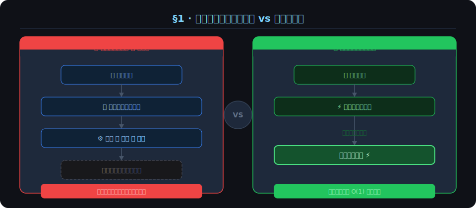
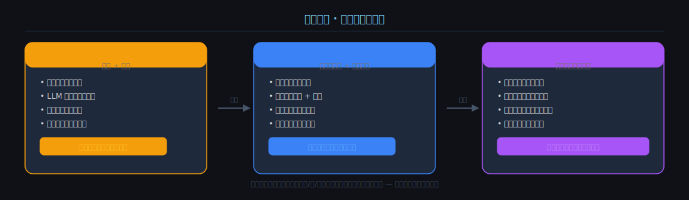
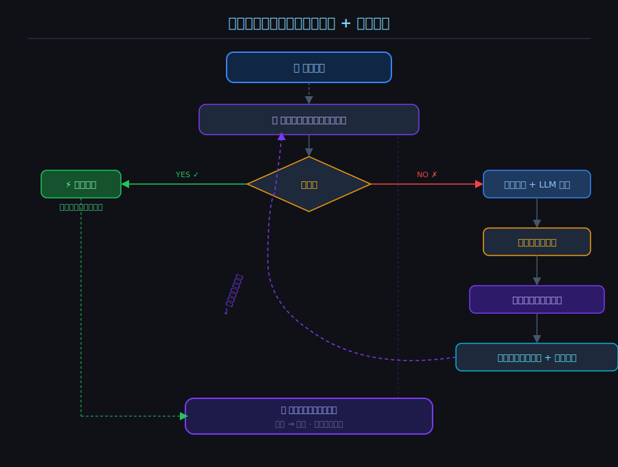
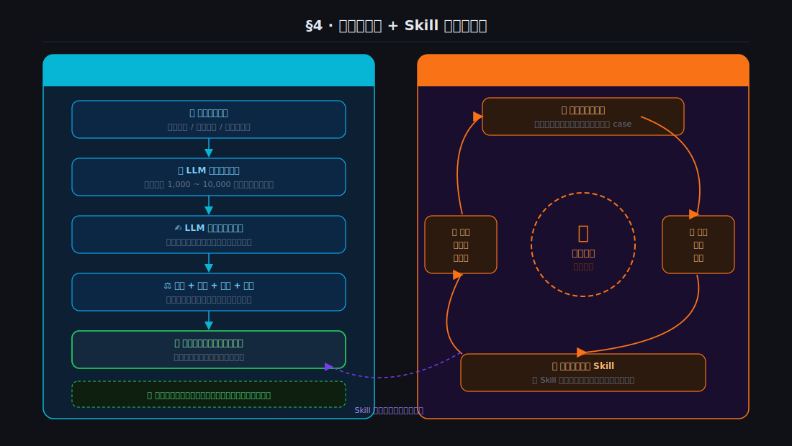

# 记忆系统架构思考

> 作者：oyjie
> 日期：2025-07
> 状态：思考草稿

---

## 一、记忆系统是什么？

### 1.1 初步思考：记忆 = 更好的搜索？

最开始的问题：**记忆系统到底是什么？是不是一个更好的搜索功能？**

传统搜索的工作方式：
- 输入关键词
- 尽可能多地检索匹配内容
- 按排名挑选最符合的若干条结果
- 返回给搜索者

这显然还不够，**搜索 ≠ 记忆**。

### 1.2 搜索 + 总结 = 记忆？

记忆不只是找到内容，还会对内容进行：
- **加工**：提炼关键信息
- **总结**：去糟粕、存精华
- **融合**：整合多个来源，生成更优的结果

因此，初步结论：

> **记忆 = 更准确的搜索 + 更好的总结**

---

## 二、重新定义记忆

### 2.1 一个反例打破「搜索+总结=记忆」的假设

考虑这样一个场景：

> 有人问：「某小说里，主角第 3 次陷入险境发生了什么？」

**如果我记住了这件事：**
→ 直接说出答案，精准描述第三次险境发生的事情。

**如果我没记住这件事：**
→ 搜索主角所有陷入险境的情节 → 数到第三次 → 提取文本 → 总结 → 返回答案

关键区别：
- 第二种方式（搜索+总结）**本质上说明我没有这个问题的记忆，我只有原始资料**。
- 下次再被问到同样的问题，我仍然需要重复这个搜索+总结的过程。

### 2.2 记忆的标准定义

> **记忆的本质 = 对问题的直接获取，没有先检索资料再总结的中间过程。**

真正的记忆是：**问题 → 直接答案**，而不是 **问题 → 资料 → 总结 → 答案**。



---

## 三、记忆的终极形态

### 3.1 当下的通用大模型其实是一种记忆

反观现在的通用大模型：
- **没有实时搜索过程**
- 通过海量语料训练
- 将人类的通用知识「记忆」固化在模型权重里

这其实就是一种记忆！只不过是**静态的、批量训练的记忆**。

### 3.2 终极记忆形态的定义

> **记忆的终极形态 = 接收数据的同时，直接将该数据与历史数据融合，持续自我迭代训练的动态大模型。**

这是一个：
- 不断接受新输入
- 实时更新自身权重
- 边回答问题，边生成记忆，边从记忆中提取已训练好的数据

的**自我进化的记忆大模型**。

### 3.3 终极形态的社会意义

当这种技术实现后：
- 通用大模型与记忆大模型将合二为一
- 机器可以自主思考和进化，无需人工干预
- 这将引发**社会级别的大变革**
- 从某种意义上说，**机器将拥有灵魂**

### 3.4 记忆系统三阶段演进路径



---

## 四、现阶段的技术限制与可行方案

### 4.1 为什么终极形态现在无法实现？

训练大模型面临的现实挑战：
- 训练周期以**天、月、年**为单位
- 需要大量语料调整、清洗等漫长过程
- **无法做到边接收输入、边实时完成训练**

### 4.2 现阶段记忆系统的可行思路

既然终极方向是「让每个问题都有一个直接的答案」，那现阶段就要朝这个方向近似实现：

**核心思路：构建问题-答案映射表，逼近直接记忆的效果**

| 场景 | 处理方式 |
|------|------|
| **有答案时** | 直接命中，返回结果 |
| **无答案时** | 走精确搜索 + 高质量总结，并将结果增量写入映射表 |
| **发散延伸** | 基于当前问题，发散生成相关问题并预生成答案 |

### 4.3 阶段二核心架构流程



---

## 五、预处理与增量处理机制

### 5.1 问题：用传统逻辑生成问答会陷入无休止的代码维护

如果手写规则来生成问题和答案，将面临：
- 规则无法覆盖用户的多样化提问
- 需要不断维护和更新逻辑
- 扩展性极差

### 5.2 参考大模型训练思路的「阉割版」方案

**核心思想：让大模型自己来生成问题和答案，而不是写死规则。**

**数据预处理阶段：**

```
输入数据（如小说角色设定）
    ↓
LLM 生成 1000 个相关问题
    ↓
LLM 为每个问题生成高质量答案
    ↓
打分 + 排序 + 筛选
    ↓
保留高质量问答对，写入记忆库
```

**数据增量处理阶段（未命中问题）：**

```
用户提问（未命中记忆库）
    ↓
精确搜索 + 高质量总结
    ↓
生成答案返回给用户
    ↓
同时，触发增量分析：
  - 将该问题+答案写入记忆库
  - 发散生成相关问题和答案
  - 增量写入记忆库
```

### 5.3 Skill 自我迭代升级

**生成问题的 Skill 本身也会不断迭代：**

- 收集大量「未命中问题」
- 分析用户的真实提问模式和思维方向
- 优化问题生成 Skill，使其更贴合大部分用户的真实思维
- 随着 Skill 不断升级，预处理数据的覆盖率和准确率越来越高

> **这是一个正向的飞轮效应：越用越准，越准越快。**

### 5.4 预处理流程与 Skill 自迭代飞轮



---

## 六、架构总结

### 6.1 核心设计原则

| 原则 | 说明 |
|------|------|
| 🎯 **目标导向** | 一切以「问题 → 直接答案」为终极目标 |
| 📈 **增量演进** | 每次未命中都是一次学习机会，持续丰富记忆库 |
| 🤖 **LLM 驱动** | 用 LLM 替代手写规则，保持灵活性和扩展性 |
| 🔄 **飞轮效应** | Skill 自迭代，系统越用越聪明，覆盖率越来越高 |
| 🚀 **朝终极逼近** | 现阶段做的每一步都要与终极记忆形态保持方向一致 |

### 6.2 一句话定义

> 现阶段的记忆系统 = **问答映射表** + **LLM 驱动的问题生成 Skill** + **增量学习飞轮**，
> 以逼近终极形态：**接收即训练、权重即记忆、问题直接命中的自迭代大模型**。

---

*文档持续更新中...*