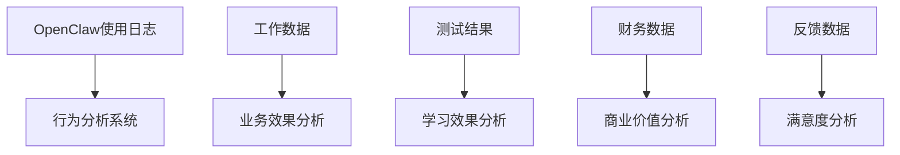
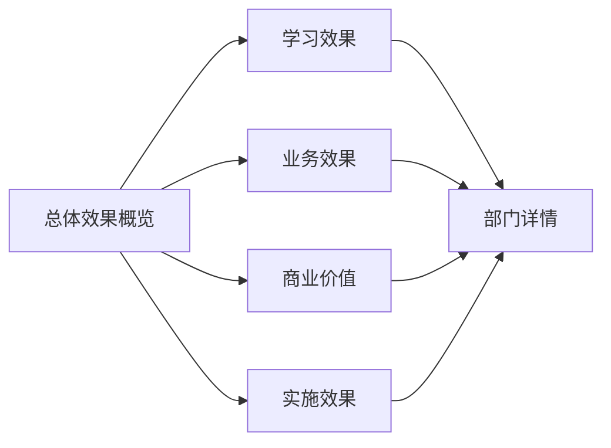

# AIGC培训效果追踪体系设计

**设计目标**：建立完整的培训效果追踪机制，确保AIGC培训的实效性和持续优化

**设计原则**：
- **数据驱动**：基于客观数据评估培训效果
- **多维评估**：从学习效果、业务效果、商业价值等多维度评估
- **实时反馈**：建立快速反馈机制，及时调整培训策略
- **持续优化**：基于效果数据持续优化培训内容和实施方式

---

## 一、效果追踪体系框架

### 1.1 多维度评估模型

| 评估维度 | 评估目标 | 评估指标 | 数据来源 | 评估周期 |
|---------|----------|----------|----------|----------|
| **学习效果** | 知识掌握程度 | 知识测试得分、技能熟练度、工具使用熟练度 | 课程测试、实操评估、学员反馈 | 每次课程后 |
| **业务效果** | 工作效率提升 | 任务完成时间、质量提升、错误率降低 | 工作日志、质量评估、主管评价 | 每月评估 |
| **商业价值** | 投资回报率 | 成本节约、收入增长、效率提升量化 | 财务数据、业务指标、ROI计算 | 每季度分析 |
| **实施效果** | 培训落地情况 | 培训覆盖率、使用频率、问题解决率 | 使用统计、问题收集、实施记录 | 持续监控 |

### 1.2 四大评估体系

#### A. 学习效果评估体系
**评估工具**：
- 知识测试系统：前测-后测对比
- 实操评估系统：任务完成质量和速度
- 学习行为分析：工具使用频率和深度
- 满意度调查：学员反馈和改进建议

**评估标准**：
- 优秀：知识测试≥90分，实操效率提升≥200%
- 良好：知识测试≥80分，实操效率提升≥150%  
- 合格：知识测试≥70分，实操效率提升≥100%
- 待改进：知识测试<70分，实操效率提升<100%

#### B. 业务效果评估体系
**评估指标**：
- **效率指标**：任务完成时间缩短率、工作吞吐量提升率
- **质量指标**：工作质量提升率、错误率降低率、客户满意度提升率
- **创新指标**：新工具应用率、创新方案数量、问题解决效率

**数据收集方法**：
- 工作日志分析：对比培训前后工作数据
- 主管评价：定期收集部门主管反馈
- 同事评价：360度评估机制
- 客户反馈：内外部客户满意度调查

#### C. 商业价值评估体系
**价值量化模型**：
```
商业价值 = (成本节约 + 效率提升价值 + 质量提升价值) - 培训成本

其中：
- 成本节约 = 人力成本节约 + 工具成本节约 + 时间成本节约
- 效率提升价值 = 时间价值 × 效率提升率
- 质量提升价值 = 质量提升带来的业务增长
- 培训成本 = 课程开发成本 + 实施成本 + 维护成本
```

**投资回报率(ROI)计算**：
```
ROI = (商业价值 - 培训成本) / 培训成本 × 100%
```

#### D. 实施效果评估体系
**实施健康度指标**：
- **覆盖度**：目标部门覆盖率、目标人员覆盖率
- **使用度**：工具使用频率、功能使用深度
- **问题率**：使用问题发生率、解决问题时效
- **满意度**：学员满意度、部门主管满意度

**实施阶段评估**：
- **实施前**：需求分析、准备情况评估
- **实施中**：进度监控、质量监控、问题处理
- **实施后**：效果评估、持续改进规划

---

## 二、效果追踪技术架构

### 2.1 数据采集层

#### 自动化数据采集


**采集工具**：
- OpenClaw使用日志分析
- 工作流程数据采集
- 在线测试系统
- 满意度调查平台
- 财务数据对接

#### 人工数据采集
- 部门主管定期访谈
- 学员反馈收集
- 实施情况记录
- 问题案例分析

### 2.2 数据处理层

#### 数据标准化
- 统一数据格式和接口
- 建立数据质量标准
- 确保数据安全和隐私保护

#### 数据分析引擎
- 统计分析工具包
- 机器学习预测模型
- 可视化分析平台
- 实时监控预警系统

### 2.3 可视化展示层

#### 效果监控看板


**展示组件**：
- 实时效果监控看板
- 部门效果对比图
- 趋势分析图表
- 问题预警系统

#### 报告生成系统
- 自动化效果报告
- 定期分析报告
- 异常情况报告
- 改进建议报告

---

## 三、实施流程设计

### 3.1 实施前准备

#### 需求调研
- 各部门AIGC需求调研
- 现有工作流程分析
- 技术基础评估
- 培训需求优先级排序

#### 基线数据收集
- 当前工作效率基准
- 工作质量基准
- 成本结构基准
- 满意度基准

#### 方案设计
- 培训方案定制设计
- 效果评估方案设计
- 技术架构设计
- 实施计划制定

### 3.2 实施中监控

#### 进度监控
- 实施进度跟踪
- 质量监控检查
- 问题收集处理
- 风险预警管理

#### 过程评估
- 阶段性效果评估
- 学员学习进度监控
- 部门配合度评估
- 资源使用效率评估

#### 动态调整
- 根据反馈调整培训内容
- 优化实施流程
- 解决突发问题
- 更新评估标准

### 3.3 实施后评估

#### 综合效果评估
- 学习效果最终评估
- 业务效果最终评估
- 商业价值最终评估
- 实施效果最终评估

#### 经验总结
- 成功经验总结
- 问题教训总结
- 最佳实践提炼
- 改进建议收集

#### 持续优化
- 建立持续改进机制
- 定期回顾和更新
- 经验分享和传播
- 标准化和推广

---

## 四、关键成功因素

### 4.1 数据质量保障

#### 数据完整性
- 确保数据采集的全面性
- 建立数据质量检查机制
- 避免数据缺失和偏差

#### 数据准确性
- 建立数据验证机制
- 定期数据清洗和校验
- 确保数据的真实性和可靠性

#### 数据时效性
- 建立实时数据采集机制
- 确保数据的及时更新
- 提供快速响应能力

### 4.2 组织保障

#### 领导支持
- 高层领导的重视和支持
- 明确的责任分工
- 充分的资源保障

#### 团队建设
- 组建专业的实施团队
- 建立跨部门协作机制
- 培养内部专业人才

#### 沟通协调
- 建立有效的沟通机制
- 定期召开协调会议
- 及时解决问题和冲突

### 4.3 技术支持

#### 工具平台
- 建立完善的工具平台
- 确保系统的稳定性和可靠性
- 提供良好的用户体验

#### 技术维护
- 建立技术维护机制
- 定期系统升级和优化
- 及时处理技术问题

#### 安全保障
- 确保数据安全和隐私保护
- 建立安全防护机制
- 符合相关法规要求

---

## 五、预期效果与价值

### 5.1 短期效果（1-3个月）

#### 学习效果
- 知识掌握率≥85%
- 工具使用熟练度≥70%
- 学员满意度≥90%

#### 业务效果
- 工作效率提升≥30%
- 工作质量提升≥20%
- 问题解决效率提升≥40%

#### 实施效果
- 培训覆盖率≥80%
- 使用频率≥60%
- 问题解决时效≤24小时

### 5.2 中期效果（3-6个月）

#### 业务效果
- 工作效率提升≥50%
- 工作质量提升≥40%
- 成本降低≥15%

#### 商业价值
- ROI≥150%
- 投资回收期≤4个月
- 业务增长贡献≥10%

### 5.3 长期效果（6-12个月）

#### 商业价值
- ROI≥300%
- 投资回收期≤2个月
- 业务增长贡献≥20%

#### 组织能力
- 建立AIGC应用能力体系
- 形成持续学习和改进机制
- 提升整体数字化水平

---

## 六、风险控制与应对

### 6.1 主要风险识别

#### 数据风险
- 数据质量风险
- 数据安全风险
- 数据隐私风险

#### 实施风险
- 进度延迟风险
- 质量不达标风险
- 资源不足风险

#### 效果风险
- 效果不达预期风险
- 使用率低风险
- 投资回报低风险

### 6.2 风险应对措施

#### 数据风险应对
- 建立数据质量控制机制
- 加强数据安全管理
- 确保隐私保护合规

#### 实施风险应对
- 制定详细实施计划
- 建立进度监控机制
- 确保资源充足

#### 效果风险应对
- 制定科学评估标准
- 建立快速反馈机制
- 及时调整实施方案

---

## 七、实施时间表

### 7.1 第一阶段（第1-2周）：准备阶段
- 完成需求调研和基线数据收集
- 制定详细的实施方案
- 组建实施团队
- 准备技术平台

### 7.2 第二阶段（第3-4周）：试点阶段
- 选择2-3个部门进行试点
- 完成数据采集和监控系统建设
- 进行初步效果评估
- 调整和优化方案

### 7.3 第三阶段（第5-8周）：全面实施阶段
- 全面推广到所有目标部门
- 完成所有数据采集和分析
- 进行阶段性效果评估
- 解决实施过程中的问题

### 7.4 第四阶段（第9-12周）：评估优化阶段
- 完成综合效果评估
- 总结经验教训
- 制定持续优化计划
- 建立长效机制

---

## 八、总结与建议

### 8.1 核心价值

#### 量化价值
- 建立科学的效果评估体系
- 提供客观的决策支持依据
- 确保培训投资的合理回报

#### 质量价值
- 提升培训质量和效果
- 持续优化培训内容和方法
- 建立长效的学习机制

#### 战略价值
- 支持数字化转型战略
- 提升整体竞争力
- 培养持续创新能力

### 8.2 实施建议

#### 优先级建议
- 优先建立基础数据采集系统
- 重点关注业务效果评估
- 加强组织保障和团队建设

#### 关键成功因素
- 高层领导的持续支持
- 各部门的积极参与
- 专业技术团队的支持
- 完善的技术平台支持

#### 持续改进
- 定期回顾和评估效果
- 及时调整和优化方案
- 分享经验和最佳实践
- 建立长效发展机制

---

**设计完成时间**：2026-04-02 20:45  
**设计负责人**：AIGC布道师  
**下一步工作**：开始构建技术实施平台